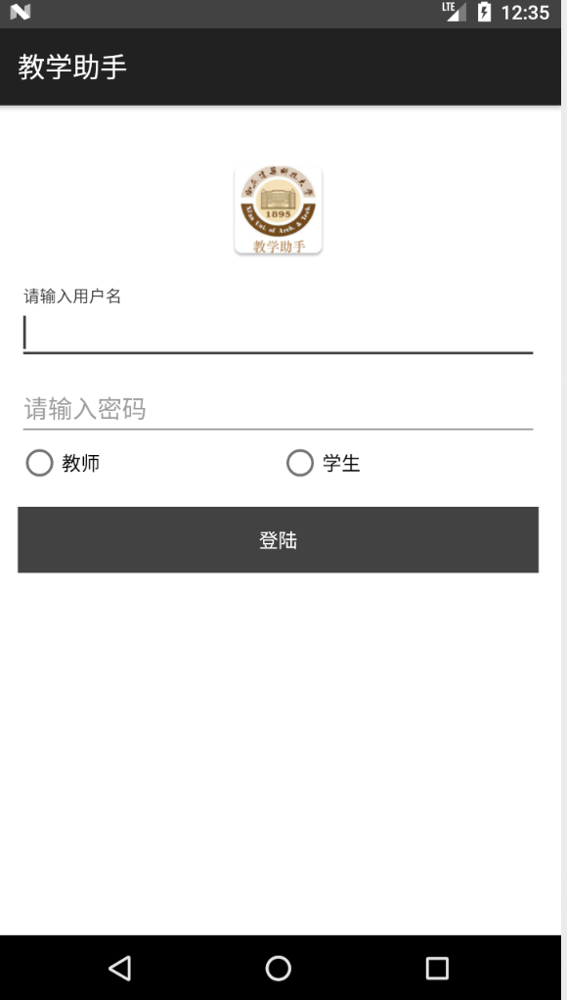
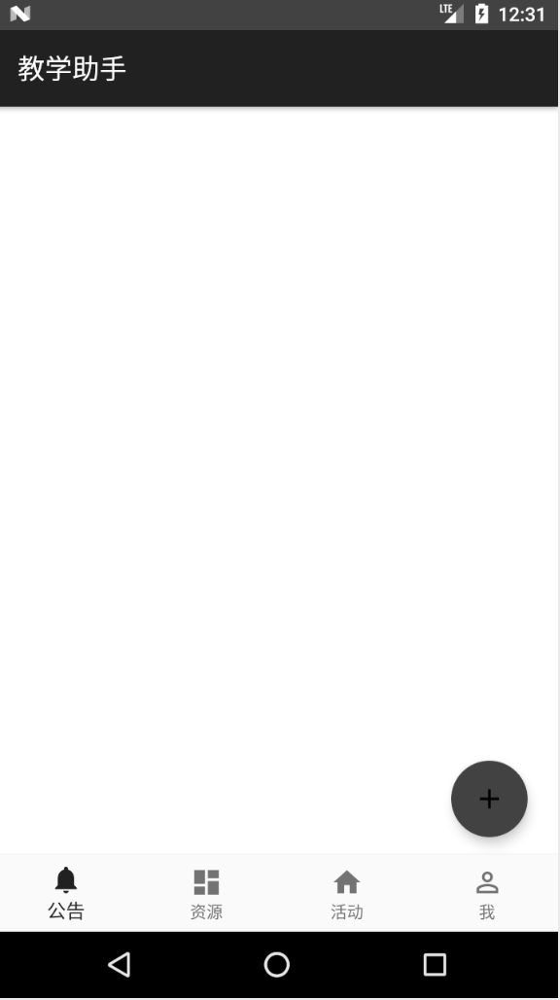
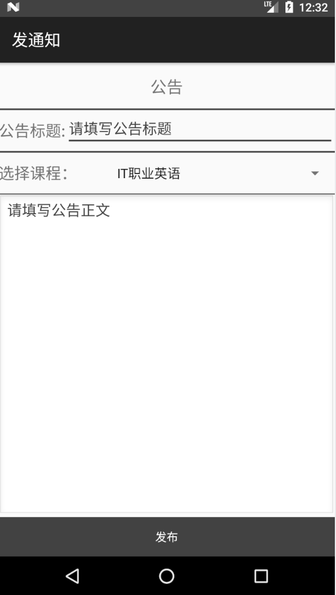
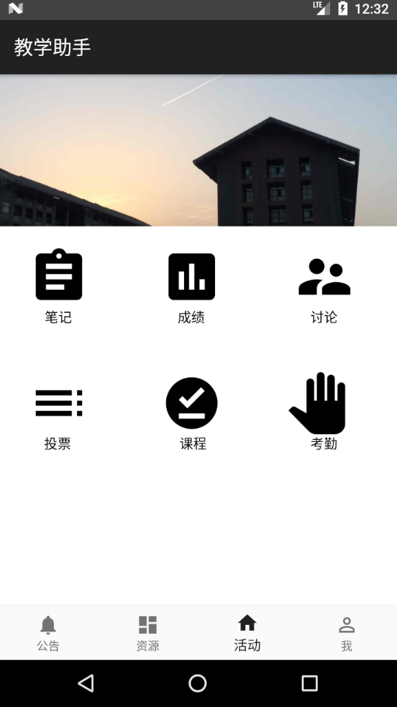
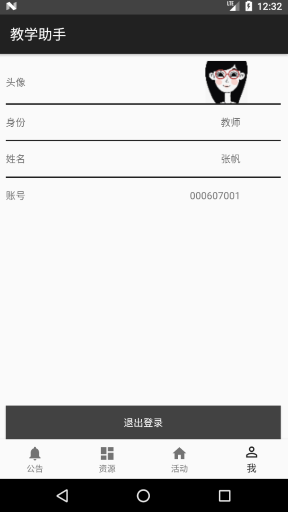
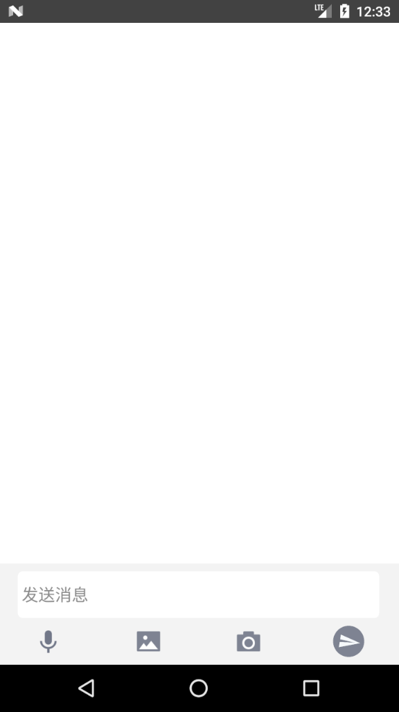
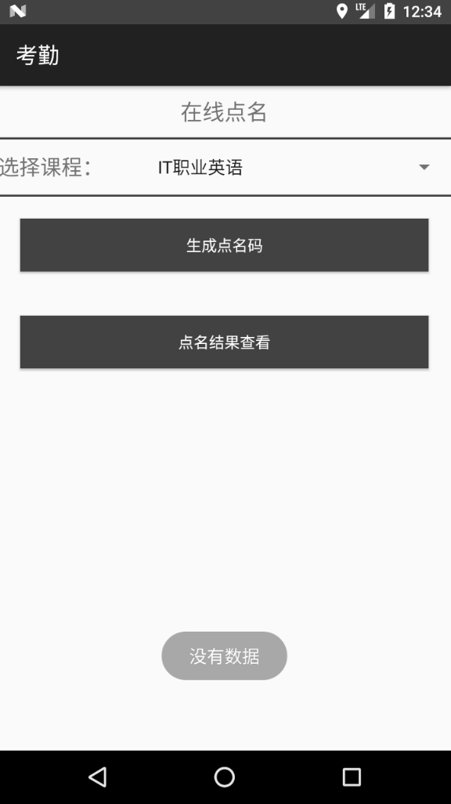
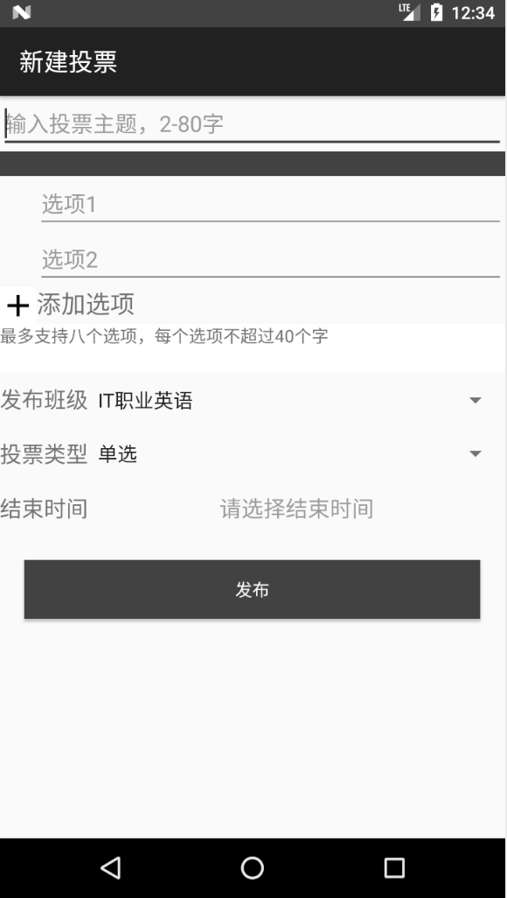
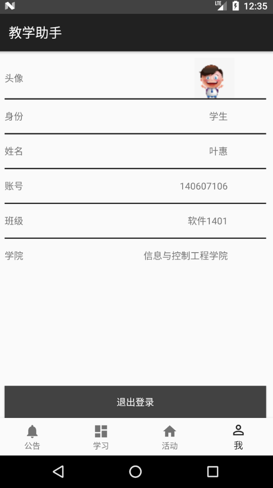

# 西安建筑科技大学移动教学助手APP
## 安装使用

将当前项目文件下载到本地，使用AndroidStudio打开项目即可

## 项目介绍
项目行基于Android进行开发，后台使用bmob云作为存储平台。

系统主要功能包括：
1. 系统主要包括教师和学生两种角色
2. 教师能够上传教学资源（包括上传本地文件、添加图文页面等）、创建教学活动（包括创建投票、问卷、讨论等）、发送教学通知
3. 学生能够对教学资源、教学活动及通知进行查看，能够下载教学资源、参加教学活动
4. 系统还能够提供对课堂考勤及考勤信息的管理，还能实现对平时成绩（包括考勤、作业、实验等）的管理及对成绩的统计功能
5. 系统还支持学生和教师之间进行实时在线交流。

## 系统界面

